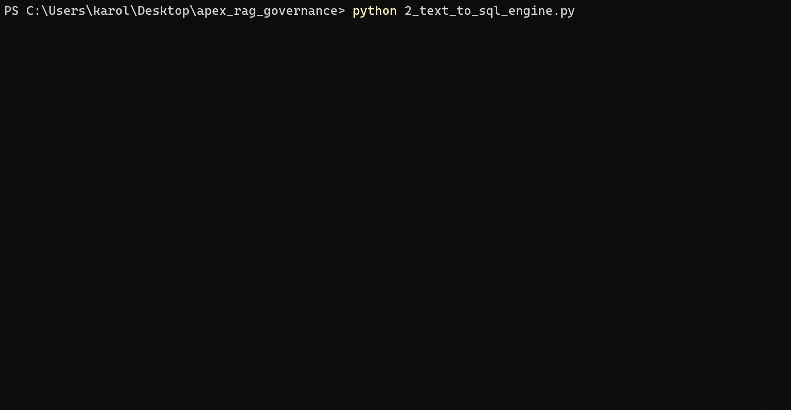
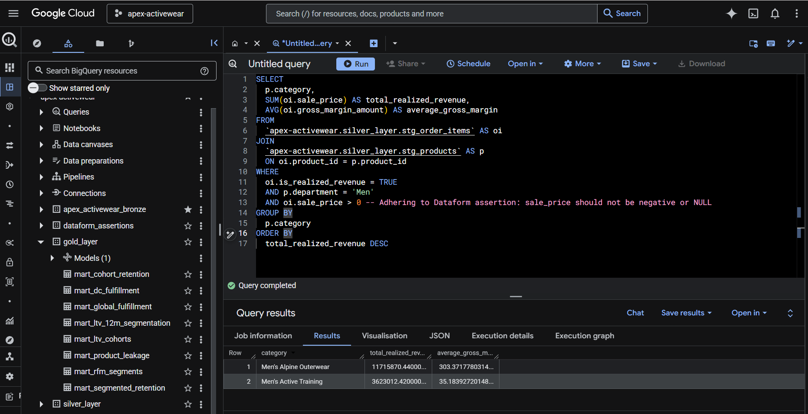

# APEX-Activewear-Strategic-Revenue-Operations-Audit

* **The Data Pipeline:** `Batch Ingestion (GCP Cloud Shell)` ➔ `Data Warehouse (BigQuery)` ➔ `Medallion Architecture (Cloud Dataform SQLX)`
* **The Pipeline Outputs (Driven by the Gold/Silver Layers):**
  * 📊 **Strategic Business Insights** (Revenue diagnostics & RFM segmentation)
  * 🧠 **Predictive Modeling** (`BigQuery ML` XGBoost churn intercept)
  * 🤖 **Governed AI Serving** (RAG Text-to-SQL via `Python`, `Google GenAI SDK`, & `JSON Semantic Layer`)

## Table of Contents
* [Executive Summary & Business Impact](#executive-summary)
* [Key Findings: The "Profit Paradox"](#key-findings)
* [I. Structural Fractures (Revenue Leakage)](#structural-fractures)
  * [1. Critical Attribution Leakage (The "Dark Traffic" Crisis)](#attribution-leakage)
  * [2. Network-Wide Fulfillment Optimization](#fulfillment-optimization)
* [II. Dormant Opportunities (Value Unlocks)](#dormant-opportunities)
  * [1. The "First Order" Multiplier (LTV Optimization)](#first-order-multiplier)
  * [2. RFM Strategic Insight: Reclaiming & Scaling](#rfm-insight)
  * [3. Predictive AI: The "Sleeping Giant" Intercept](#predictive-ai)
* [III. AI-Powered Semantic Layer & BI Governance](#ai-governance)
* [🛠️ Analytics Engineering & Data Architecture](#analytics-engineering)
  * [Data Scope & ERD](#data-scope)
  * [Medallion Pipeline & Guardrails](#tech-implementation)

---

# Executive Summary & Business Impact

**APEX Activewear** is a simulated e-commerce dataset scaled to **$48.85M in realized lifetime revenue** (net of returns and cancellations) across North America, built on over **436K+** processed orders, a **$148 AOV**, and a **53.9% Gross Margin**.

**The Business Problem:** Top-line growth decelerated from 344% YoY to just 9.8%, exposing structural revenue leakage. A diagnostic audit of the revenue engine revealed four systemic risks obscuring profitability. **[Access SQL Queries](Strategic_Insights/Executive_Summary.sql)**

**Key Deliverables & Identified ROI:**
* **$34.3M Attribution Recovery:** Diagnosed mid-funnel session breaks misattributing 68% of revenue to "Direct" traffic.
* **$33.3M Retention Target:** Deployed RFM segmentation to isolate dormant "Sleeping Giant" users globally.
* **Predictive Churn Automation:** Built an early-warning ML model identifying users 30 days before they churn.
* **21% Fulfillment Speed Gain:** Proposed a 'Clean Flow' protocol to cut delivery lag from 5.1 to 4.1 days.

---

# Key Findings: The "Profit Paradox"

* **Growth Deceleration:** Momentum dropped from a peak of **344%** (Q2 2023) to **9.8%** (Q4 2025). Future revenue gains must come from maximizing Lifetime Value (LTV) rather than net-new acquisition. 🔗 **[Access SQL Queries](Strategic_Insights/Key_Findings__Growth_Deceleration.sql)**
  

* **Critical Attribution Leakage:** We are "flying blind" on **68.3%** of total revenue. Untraceable mid-funnel breaks are starving ad algorithms and inflating Customer Acquisition Cost (CAC). 🔗 **[Access SQL Queries](Strategic_Insights/Key_findings__Critical_Attribution_Leakage.sql)**
  

* **Category-Specific Profit Drag:** Men's Alpine Outerwear incurs **$3.2M** in return losses. A **~24% total loss rate** across top categories means one-quarter of operational effort generates zero realized revenue. 🔗 **[Access SQL Queries](Strategic_Insights/Key_findings__Category-Specific_Profit_Drag.sql)**
  

* **Systemic Retention Risk:** RFM segmentation reveals **$33.3M** in lifetime revenue is trapped globally in the dormant "At Risk / Can't Lose" segment. 🔗 **[Access SQL Queries](Strategic_Insights/Key_findings__Geographic_Saturation.sql)**

**The Strategic Pivot:** The data confirms APEX must transition to a value-driven model by fixing **Structural Fractures** (Logistics & Attribution) and unlocking **Dormant Opportunities** (LTV & Predictive Churn).

---

# I. Structural Fractures (Revenue Leakage)

### 1. Critical Attribution Leakage (The "Dark Traffic" Crisis)
**Stakeholder:** CMO & Data Engineering Lead | **Priority:** 🔴 CRITICAL

* **Insight:** Genuine users don't "teleport" to checkout. The complete absence of funnel history for 225k+ orders proves mid-session tracking breaks are creating "dark traffic," starving paid ad algorithms of conversion data and artificially inflating our CAC. 🔗 **[Access SQL Queries](Strategic_Insights/Structural_Fractures_(Revenue_Leakage).sql)**
* **Action:** Execute an immediate Tech Audit on the "Session-Break Triad" (whitelist payment gateways, verify cross-domain cookies, audit 301 redirect UTMs).
* **Impact:** Re-attribute **~$34.3M** to its true source, allowing marketing to scale budgets based on True ROAS.

### 2. Network-Wide Fulfillment Optimization
**Stakeholder:** COO & Supply Chain Lead | **Priority:** 🟠 HIGH

* **Insight:** Inbound returns are actively cannibalizing outbound sales capacity. Distribution centers are prioritizing inventory restocking over revenue capture, creating a universal 2.1-day fulfillment lag. 🔗 **[Access SQL Queries](Strategic_Insights/Structural_Fracture_2.Network_Wide_Fulfillment_Optimization.sql)**
* **Action:** Implement a **'Clean Flow' SOP**, a strict operational decoupling mandating all outbound orders clear in <24 hours before labor shifts to returns. Launch a 4-week pilot in Reno, NV.
* **Impact:** Compresses total fulfillment cycle time from 5.1 to 4.1 days (a **21%** speed gain) without requiring carrier shipping upgrades.

---

# II. Dormant Opportunities (Value Unlocks)

### 1. The "First Order" Multiplier (LTV Optimization)
**Stakeholder:** Head of Growth | **Priority:** 🟠 HIGH

* **Insight:** Customer retention degrades structurally over time, but **First Order Value is a massive predictor of lifetime worth**. Customers starting with a basket >$90 generate a **56% lift in LTV**, yet share the exact same churn curve as low-value buyers. 🔗 **[Access SQL Queries](Strategic_Insights/The_First_Order_Multiplier.sql)**
* **Action:** Transition from flat discounts to **Tiered Thresholds** (e.g., "Save $20 on Orders >$100") to force users to self-select into the High-Value tier on Day 1.
* **Impact:** Unlocks **$185 incremental LTV** per user. Nudging just 1,000 baseline users across this threshold generates $185,000 in risk-free revenue.

### 2. RFM Strategic Insight: Reclaiming & Scaling
**Stakeholder:** Head of Retention | **Global Revenue Impact:** ~$39M

Dividing our 122k+ user base into actionable RFM (Recency, Frequency, Monetary) cohorts isolates three segments requiring distinct interventions. 🔗 **[Access SQL Queries](Strategic_Insights/rfm_strategic_insights.sql)**

* **A. The "Sleeping Giant" (Reactivation):** $33.3M is dormant. Deploy an SMS-first "Pending Credit" sequence utilizing loss aversion to reclaim ~$3.33M at a conservative 10% win-back rate.
* **B. The "Tipping Point" (Upsell):** 10,996 active users haven't reached the "Loyal" tier. Deploy targeted bundle offers to inflate AOV, migrating 20% of this group to generate ~$1.1M in incremental LTV.
* **C. Cloning the Champions (Acquisition):** Merge 122 international "Champions" with "Loyal Customers" to build a statistically stable seed audience, providing ad pixels the critical mass needed to clone high-value users.

###  🧠 3. Predictive AI: The "Sleeping Giant" Intercept
**Stakeholder:** Head of Retention 

* **Insight:** Standard RFM segmentation is reactive—it only identifies churn *after* the revenue is lost. To intervene preemptively, I trained an in-warehouse XGBoost model using BigQuery ML to catch flight risks before they leave. 🔗 **[Access SQL Queries](Strategic_Insights/BigQuery_ML_(XGBoost).sql)**
* **Action:** Engineered a rolling 180-day behavioral snapshot directly from the Silver layer, feeding the model real-time signals like return frequency and delivery lag to calculate daily churn probability.
* **Impact:** The model achieved production-grade reliability with a standout **94.5% Precision rate**. In business terms, this means 94.5% of the users flagged by the model are genuine flight risks. This powers a daily **"Live Risk List,"** allowing marketing to trigger automated SMS win-back credits without wasting margin on users who were going to stay anyway.
---

### III. AI-Powered Semantic Layer & BI Governance

**Target:** Stakeholder Self-Service & Metric Standardization 

* **The Bottleneck:** Out-of-the-box LLMs inherently hallucinate business logic. Without guardrails, they blindly query raw tables, missing critical context like "Ghost Revenue" filters or our 24% return rate.
* **The Architecture:** Engineered a custom **Retrieval-Augmented Generation (RAG) Governance CLI** that intercepts stakeholder natural-language questions and binds the AI strictly to our validated Dataform pipeline logic.
* **Technical Execution:** Built a Python engine to dynamically parse BigQuery schemas and `Dataform Assertions` into a structured JSON dictionary. The LLM is prompt-restricted exclusively to the `gold_layer`, ensuring it outputs clean, compliant BigQuery Standard SQL.
* **Business Impact:** **"Zero-Hallucination" self-serve analytics.** Stakeholders can now query the warehouse in plain English with mathematical certainty that the generated SQL perfectly matches the CFO's definition of realized revenue.
#### *A sample governed query:*

#### *Ground Truth Verification: Executing the Governed Query in BigQuery*

---

# 🛠️ Analytics Engineering & Data Architecture

To perform this audit, I architected a scalable Medallion pipeline to act as a "source of truth," connecting the entire customer lifecycle—from the initial website visit to the final delivery and potential return.

### Data Scope & ERD
* **Volume:** **1.33M** online events, **436K+** orders, **122K+** unique users, and integration across **11** distribution centers.
* **Staging Schema:** The ERD below represents the foundational `stg_` nodes.

### Medallion Pipeline & Guardrails
Enforced a strict `stg_` ➔ `int_` ➔ `mart_` DAG progression using **Cloud Dataform**, centralizing business logic in the Silver layer to eliminate downstream metric drift.

* **Scalable Architecture:** Designed to scale from 300MB to petabyte volume without structural redesign. Partitioned tables by `TIMESTAMP_TRUNC` to manage high-cardinality data and clustered on low-cardinality IDs to prevent block fragmentation.
* **Event-Driven Ingestion:** Deployed GCS-triggered Cloud Functions for landing files, with centralized source declarations via Dataform JS configs (`bronze_sources.js`) to insulate against upstream schema breaks.
* **Defensive Modeling:**
  * **Circuit Breakers:** Built a "Dark Traffic" alert halting updates if `Direct` traffic exceeds 20% of revenue. Enforced null checks on primary keys.
  * **Temporal Locks:** Validated chronological integrity (`created_at` ➔ `shipped_at` ➔ `delivered_at`) using `COALESCE` and `GREATEST` to handle nulls and protect financial averages.
  * **Financial Integrity:** Locked `is_realized_revenue` to valid business statuses and implemented defensive casting for bulletproof downstream joins.
* **Anomaly Handling:** Instead of filtering edge cases in Staging (e.g., carrier "Return to Sender" events), I engineered a `has_timeline_anomaly` boolean flag in the Silver layer. This preserves raw data for logistics QA while allowing Gold layer LTV models to cleanly bypass bad records.
