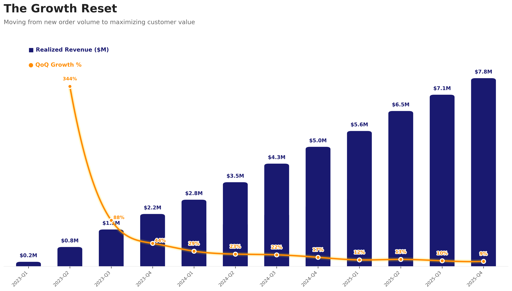

# APEX-Activewear-Strategic-Revenue-Operations-Audit

# Executive Summary

**APEX Activewear** has reached a pivotal operational crossroads. As a premier retailer specializing in **high-performance alpine outerwear, technical footwear, and adventure-ready gear**, we have successfully scaled to **$48.85M in lifetime revenue** between January 2023 and early 2026. With over **436K+** orders processed, we have proven our market fit across the United States, our core market, Mexico and Canda have establishing solid unit economics that include a **$148 AOV** and a **53.9% Gross Margin**.

Despite these strong foundational metrics, our ability to continue scaling through volume alone has stalled. To identify the specific friction points hindering our next phase of expansion, a **diagnostic audit of the revenue engine** was conducted. This analysis moved beyond surface-level performance to reveal four structural risks that aggregate metrics were obscuring.

<small>_[Access Executive Summary SQL Queries](Analytics_Engineering/Executive_Summary.sql)_</small>

# Data Architecture & Scope 

To perform this audit, a relational data model was built to connect the entire customer lifecycle—from the initial website visit to the final delivery and potential return. By linking marketing events, transactions, and logistics, I created a **"source of truth"** to identify specific friction points where revenue was leaking and margins were being eroded. (Note: the tables in the ERD are the **Staging Layer** (the stg_ nodes), see the **Directed Acyclic Graph (DAG)** and full **Medallion Transformation** flow in the Analytics Engineering section.)  

APEX Activewear **Entity Relationship Diagram:**

**Audit Scale & Data Volume:**
* _stg_online_events_ (fact table): **1.33M** online events and user touchpoints captured.
* _stg_orders_: **436K+** orders analysed split across unique **122k+** users in _stg_users_ table
* _stg_order_items_ (fact table): **544K+** order records processed across the US, Canada, and Mexico.
* _stg_products_: performance and return-rate data for over **2000** unique SKUs.
* _stg_distribution_centers_: integration with **11** distribution centers data to reconcile realized revenue against operational costs.

# Key Findings: The "Profit Paradox 

* **Growth Deceleration:** We have moved past the hyper-growth phase. From a peak of **344%** growth in Q2 2023, momentum has steadily declined to single digits (**9.8%**) in Q4 2025. Future revenue gains must come from maximizing customer lifetime value rather than new order volume.

<small>_[Access Growth Deceleration SQL queries](Analytics_Engineering/Key_Findings:_Growth_Deceleration.sql)_</small>

