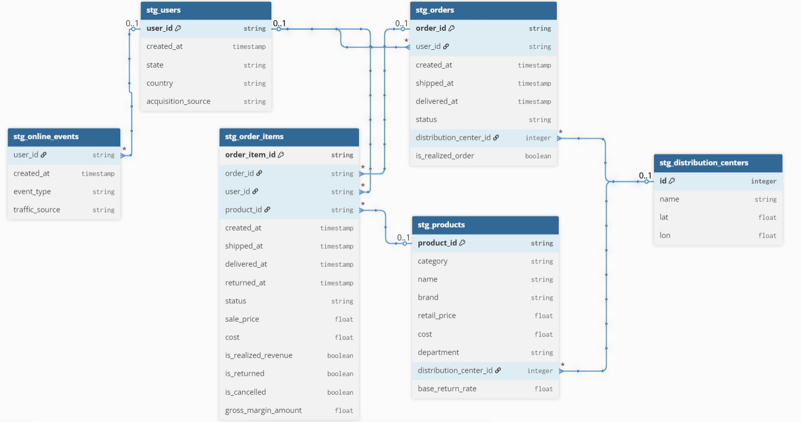
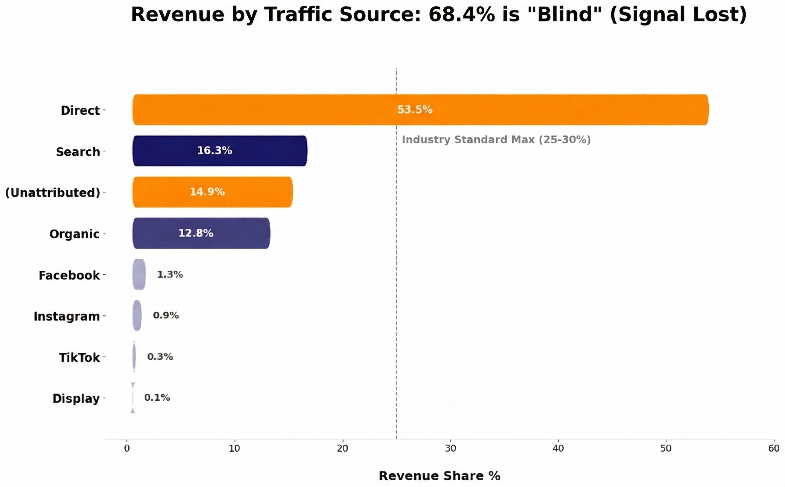
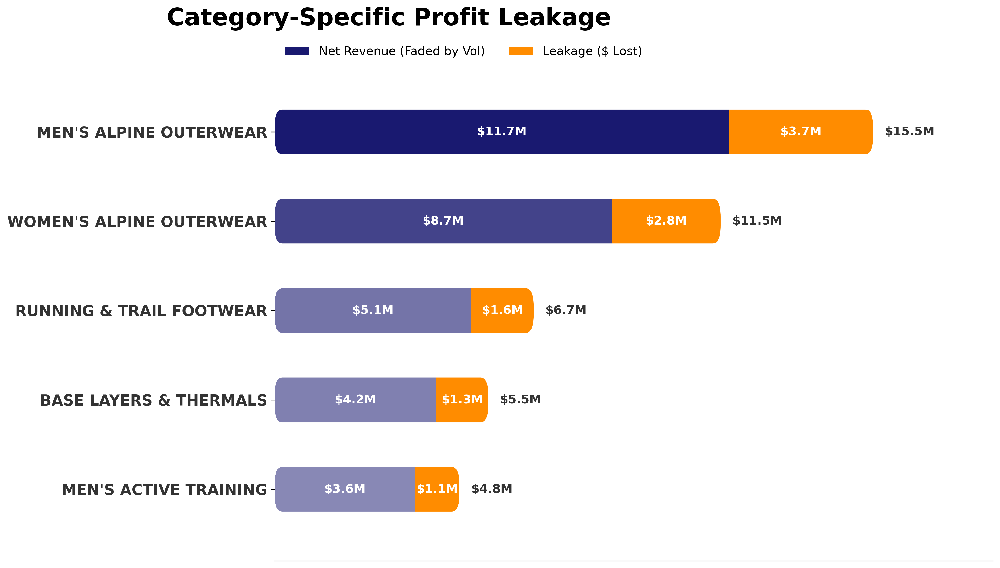
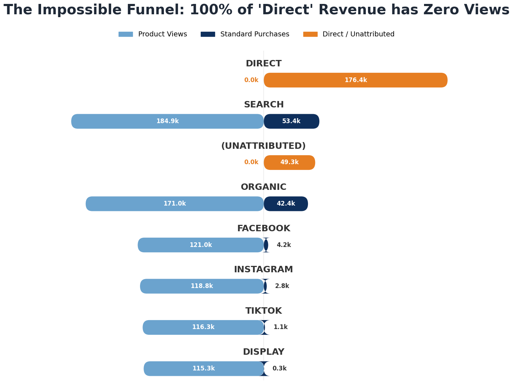
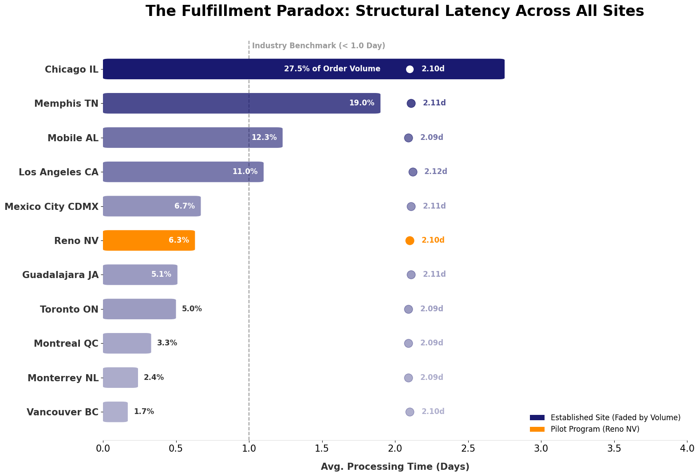
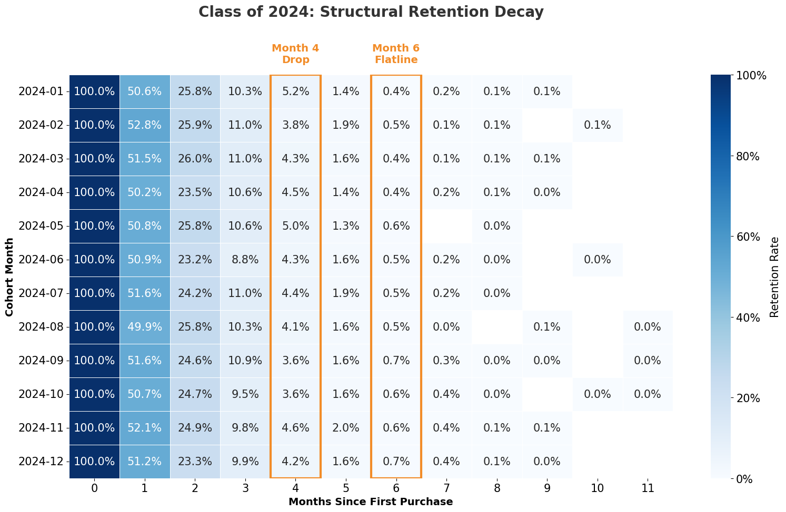
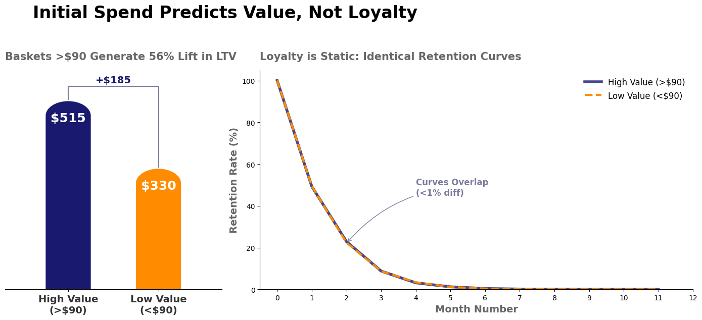
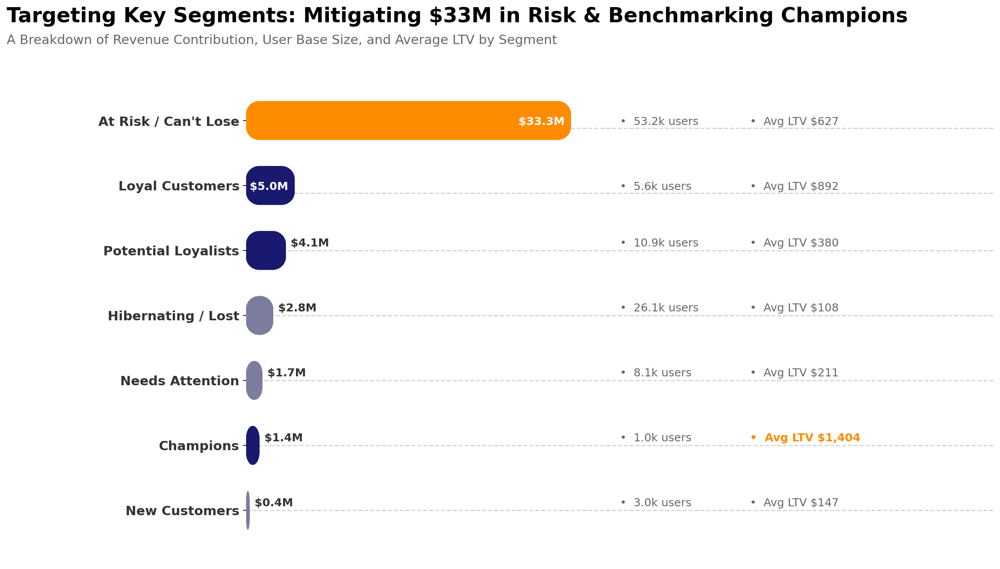

# APEX-Activewear-Strategic-Revenue-Operations-Audit
## Table of Contents

* [Executive Summary](#executive-summary)
* [Data Architecture & Scope](#data-architecture--scope)
* [Key Findings: The "Profit Paradox"](#key-findings-the-profit-paradox)
* [I. Structural Fractures (Revenue Leakage)](#i-structural-fractures-revenue-leakage)
  * [1. Critical Attribution Leakage (The "Dark Traffic" Crisis)](#1-critical-attribution-leakage-the-dark-traffic-crisis)
  * [2. Network-Wide Fulfillment Optimization](#2-network-wide-fulfillment-optimization)
* [II. Dormant Opportunities (Value Unlocks)](#ii-dormant-opportunities-value-unlocks)
  * [1. The "First Order" Multiplier (LTV Optimization)](#1-the-first-order-multiplier-ltv-optimization)
  * [2. RFM Strategic Insight: The "Sleeping Giant" & Beyond](#2-rfm-strategic-insight-the-sleeping-giant--beyond)
    * [A. The "Sleeping Giant" Protocol (Retention)](#a-the-sleeping-giant-protocol-retention)
    * [B. The "Tipping Point" (Upsell)](#b-the-tipping-point-upsell)
    * [C. Cloning the Champions (Acquisition)](#c-cloning-the-champions-acquisition)
* [Analytics Engineering & Data Quality](#analytics-engineering--data-quality)
  * [🛠 Technical Implementation: Production-Grade Data Pipeline](#technical-implementation-production-grade-data-pipeline)
  * [🚀 Infrastructure & Cost Optimization](#infrastructure--cost-optimization)
  * [🛡️ Defensive Data Modelling & Guardrails](#defensive-data-modelling--guardrails)
  * [🔍 Engineering Decisions: Handling the "In-Transit Return"](#engineering-decisions-handling-the-in-transit-return)

# Executive Summary

**APEX Activewear** has reached a pivotal operational crossroads. As a premier retailer specializing in **high-performance alpine outerwear, technical footwear, and adventure-ready gear**, we have successfully scaled to **$48.85M in lifetime revenue** between January 2023 and early 2026. With over **436K+** orders processed, we have proven our market fit across the United States, our core market, Mexico and Canda have establishing solid unit economics that include a **$148 AOV** and a **53.9% Gross Margin**.

Despite these strong foundational metrics, our ability to continue scaling through volume alone has stalled. To identify the specific friction points hindering our next phase of expansion, a **diagnostic audit of the revenue engine** was conducted. This analysis moved beyond surface-level performance to reveal four structural risks that aggregate metrics were obscuring. <small>_[Access Executive Summary SQL Queries](Analytics_Engineering/Executive_Summary.sql)_</small>

# Data Architecture & Scope 

To perform this audit, a relational data model was built to connect the entire customer lifecycle—from the initial website visit to the final delivery and potential return. By linking marketing events, transactions, and logistics, I created a **"source of truth"** to identify specific friction points where revenue was leaking and margins were being eroded. (Note: the tables in the ERD are the **Staging Layer** (the stg_ nodes), see the **Directed Acyclic Graph (DAG)** and full **Medallion Transformation** flow in [Analytics Engineering part](#analytics-engineering--data-quality).)  

APEX Activewear **Entity Relationship Diagram:**

**Audit Scale & Data Volume:**
* _stg_online_events_ (fact table): **1.33M** online events and user touchpoints captured.
* _stg_orders_: **436K+** orders analysed split across unique **122k+** users in _stg_users_ table
* _stg_order_items_ (fact table): **544K+** order records processed across the US, Canada, and Mexico.
* _stg_products_: performance and return-rate data for over **2000** unique SKUs.
* _stg_distribution_centers_: integration with **11** distribution centers data to reconcile realized revenue against operational costs.

# Key Findings: The "Profit Paradox 

* **Growth Deceleration:** We have moved past the hyper-growth phase. From a peak of **344%** growth in Q2 2023, momentum has steadily declined to single digits (**9.8%**) in Q4 2025. Future revenue gains must come from maximizing customer lifetime value rather than new order volume.
<small>_[Access Growth Deceleration SQL queries](Analytics_Engineering/Key_Findings__Growth_Deceleration.sql)_</small>

* **Critical Attribution Leakage:**  We are effectively "flying blind" on **68.3%** of our total revenue (Direct + Unattributed). The digital thread is severing mid-funnel, meaning we cannot track the ROI on **~$34.3M** of revenue, likely leading to massive inefficiencies in paid ad spend. 
 <small>_[Access Critical Attribution SQL queries](Analytics_Engineering/Key_findings__Critical_Attribution_Leakage.sql)_</small>

 

* **Category-Specific Profit Drag:** Men's Alpine Outerwear remains the top revenue driver (**$15.5M Gross**), but it is also the primary source of operational drag, incurring **$3.2M** in return losses alone. Across top categories, the "Total Loss Rate" (returns + cancellations) creates a stabilized drag of **~24%**. Effectively, one-quarter of the operational effort in these key segments generates zero realized revenue. 
<small>_[Access Category Specific SQL queries](Analytics_Engineering/Key_findings__Category-Specific_Profit_Drag.sql)_</small>

     

* **Geographic Saturation & Systemic Risk:** Our revenue engine is heavily centralized, with the United States generating 76.3% ($37.25M) of total lifetime revenue. The decline in momentum to 9.8% indicates US market saturation. Furthermore, our retention liability scales proportionally across all borders. By utilizing **RFM (Recency, Frequency, Monetary) customer segmentation** to divide the user base into actionable cohorts based on purchasing behavior, we identified that over $33.3M in lifetime revenue is globally tied up in the "At Risk / Can't Lose" segment (US: $25.4M, MX: $4.4M, CA: $3.5M).  This proves our mid-term retention mechanics are failing consistently across all markets, making **a structural retention overhaul** a mandatory global fix, not just a localized tactic.
<small>_[Access Geographic Saturation SQL queries](Analytics_Engineering/Key_findings__Geographic_Saturation.sql)_</small>

**The Strategic Pivot: From "Health Check" to "Root Cause":**

The data confirms that APEX is not a volume-driven business, but a value-driven one. Future growth requires a pivot to **"Threshold Engineering"**—shifting focus from broad acquisition to incentivizing high-quality customer entry points. This analysis targets two specific areas: 

* **Structural Fractures:** Identifying silent operational errors—specifically in marketing attribution and inbound operational drag—that are actively obscuring ROI and leaking revenue. 
* **Dormant Opportunities:** Building on our RFM analysis to strategically target the "Sleeping Giant" and "Missing Middle" segments. By proving first-order behavior as a universal LTV predictor, we leverage a 2.3x LTV multiplier from our cross-border RFM data to A/B test adapted US retention tactics in Mexico and Canada, dynamically adjusting for regional shipping and customs to scale profitably.

# I. Structural Fractures (Revenue Leakage)

### 1. Critical Attribution Leakage (The "Dark Traffic" Crisis)

* **Stakeholder:** CMO (Strategy) & Data Engineering Lead (Execution) **Primary Goal:** Eliminate Blind Ad Spend
* **Key Metrics :**

    **Total "Blind" Revenue:** 68.4% (Target: <20%)
    
    * *Direct Traffic:* **53.5%** ($26.8M)
    * *Unattributed:* **14.9%** ($7.5M)

    **Impacted Volume:** ~$34.3M in Revenue
    **Signal Loss:** 100% of "Direct" buyers had 0 Product Views

A massive structural fracture was detected in our attribution data. While "Direct" traffic typically accounts for 20-30% of revenue in this industry, a **critical mass** of our revenue is currently untraceable.

To prove this wasn't just loyal customers typing the URL, I analyzed the funnel depth. The results were conclusive: **225,774 orders** (176k Direct + 49k Unattributed) were placed without a single product view. 
<small>_[Access Revenue Leakage SQL queries](Analytics_Engineering/Structural_Fractures_(Revenue_Leakage).sql)_</small>

  

  Genuine users do not just "teleport" to check out, they browse. This complete absence of history proves the digital thread is being severed, stripping attribution from the channels that actually generated the sale.
    **Recommended Action:** Immediate **Tech Audit** to repair cross-domain session stitching focusing on the "Session-Break Triad":
        **Referral Exclusions:** Whitelist payment gateways (e.g., PayPal, Stripe) to prevent them from overwriting the original traffic source.
        **Cross-Domain Tracking:** Verify that cookies persist accurately between the main shop and the checkout subdomain.
        **Redirect Protocols:** Ensure 301 redirects are not stripping UTM parameters before the analytics tag fires.

**Impact:** Correcting this would reattribute **~$34.3M** (implied revenue opportunity) to its true source, allowing marketing to optimize their budget based on **True ROAS** rather than flying blind.

### 2. Network-Wide Fulfillment Optimization
* **Stakeholder**: COO (Operations)
* **Primary Goal**: Unblock Supply Chain Velocity
* **Key Metrics**:
    Avg Shipping Time: **2.1 Days** (Target: <1 Day)
    Return Rate: **21.62%** (High Operational Drag)
    Effective Capacity Loss: **~22%** of Warehouse Labor

Our supply chain is fighting a civil war. Decomposing the delivery timeline reveals that inbound returns are actively cannibalizing outbound sales capacity. With a **21.6% Return Rate**, our distribution centers have morphed into 'Churn Factories,' where returns processing consumes **~22% of total labor**. This resource drain is the structural cause of our uniform **2.1-day fulfillment lag**—we are prioritizing inventory restocking over revenue capture. <small>_[Access Fulfillment Optimization SQL queries](Analytics_Engineering/I.Structural_Fracture_2.Network_Wide_Fulfillment_Optimization.sql)_</small>

**Recommended Action:** to recover this speed entirely in-house without costly carrier upgrades, implement a **'Clean Flow' SOP**: a strict prioritization protocol that mandates all outbound orders clear in **<24 hours** before labor shifts to returns. This decoupling will compress total cycle time from **5.1 to 4.1 Days** (a 21% speed gain).  
Launch a **4-week pilot** in **Reno, NV** to stress-test the SOP against representative volume/return mixes before scaling to the 'Big Three' hubs (Chicago, Memphis, Mobile).

# II. Dormant Opportunities (Value Unlocks)

### 1. The "First Order" Multiplier (LTV Optimization)
* **Stakeholder**: Head of Growth &nbsp;&nbsp;&nbsp;&nbsp; **Primary Goal**: Engineer Higher Lifetime Value (LTV) at Point of Sale
* **Key Metrics**:
    High-Value LTV: **$516** (Cohort: Initial Order >$90)  
    Retention Rate (Month 4): **4.29%** (Stable Decay)  
    Value Multiplier: **+56%** LTV lift from higher initial spend.

Our customer retention degrades structurally. Data from the Class of 2024 reveals a steep drop from **50% in Month 1** to just **4.29% in Month 4**, essentially flatlining by **Month 6 (0.53%)**. The "leaky bucket" is a structural reality of our current model. <small>_[Access Cohort Heatmap SQL queries](Analytics_Engineering/APEX_Cohort_Results.sql)_</small>

Since we cannot rely on long-term loyalty to drive profit, we must capture value **upfront**. Analysis proves that **First Order Value** is the single strongest predictor of future customer worth. Customers who start with a basket **>$90** generate **56% lift in Lifetime Value** ($515) than those who start smaller ($330). 

Moreover, **High-Value** ($516 LTV) and **Low-Value** ($330 LTV) customers share **identical retention curves** making customer loyalty **static**.

* **Recommended action** is to shift acquisition incentives from **Generic Conversion** to **Threshold Engineering**. Replace flat discounts with **Tiered Thresholds** (e.g., "Save $20 on Orders >$100") to force users to self-select into the High-Value tier on Day 1 as profit is determined solely by the **First Order Value**.

* **Impact:** Unlocks **$185 incremental LTV** per user immediately. Nudging just 1,000 users across this line generates **$185,000 in risk-free revenue** without acquiring a single extra customer. <small>_[Access LTV Segmentation SQL queries](Analytics_Engineering/The_First_Order_Multiplier.sql)_</small>

  

### 2. RFM Strategic Insight: The "Sleeping Giant" & Beyond

**Scope of Insight:** 3 Key Segments | ~$39M Revenue Impact | ~71k Users **Stakeholder:** Head of Growth & Retention

Our strategy rests on three **imperatives**: executing the **'Sleeping Giant' Protocol** to reclaim dormant revenue, leveraging the **'Tipping Point'** to expand mid-tier LTV, and **Cloning the Champions** to refine high-value acquisition. <small>_[Access RFM Segmentation SQL queries](Analytics_Engineering/rfm_strategic_insights.sql)_</small>

### A. The "Sleeping Giant" Protocol (Retention)

**Priority:** 🔴 CRITICAL (Immediate Revenue Risk)

The "At Risk / Can't Lose" segment represents the business's most critical vulnerability. **$33.3M** (68.1% of historical revenue) is locked in a group that currently contributes $0. The goal is to prevent permanent churn of our most valuable asset.

**Key Metrics:**
* **Dormant Revenue:** $33.3M (US $25.4M | MX $4.4M | CA $3.5M)
* **Impacted Volume:** 53,205 Users globally (US: 40,465 | MX: 7,444 | CA: 5,296)
* **Revenue Opportunity:** ~$3.33M (Based on conservative 10% win-back target)

**Re-engagement Strategy: SMS-First & Expiring Credit**
* **Primary Channel:** Prioritize SMS outreach to capitalize on the channel's ~98% open rate
* **Core Tactic:** Drive conversions using loss aversion. Instead of standard percentage discounts, frame the offer as a "Pending Credit" (e.g., *"You have a $50 store credit expiring soon"*).
* **Localization:** Dynamically translate the SMS content (e.g., French for certain Canadian segments, Spanish for US/Mexican segments) based on the language preferences captured during the customer's initial checkout.
* **Tiered Execution:**
  * **Tier A (Lifetime Value > $600):** Invest in direct SMS outreach featuring the premium $50 credit offer.
  * **Tier B (Lifetime Value $150 - $600):** Protect profit margins by offering a lower $20 credit via SMS, or by shifting this segment to an email-only sequence.

### B. The "Tipping Point" (Upsell)

**Priority:** 🟠 HIGH (Easiest LTV Lift)
**Target Segment:** Potential Loyalists

We have a "Missing Middle" opportunity. These users are active and valuable (**$380 AVG LTV**) but have not yet reached the "Loyal" tier (**$890 AVG LTV**). They do not need reactivation; they need acceleration.

**Key Metrics:**
* **Volume:** 10,996 Users
* **Current Revenue:** $4.2M
* **Goal:** Migrating 20% to "Loyal" tier generates **~$1.1M incremental revenue.**

**Strategy:**
* **Tactic:** Bundle & Volume Upsells.
* **Execution:** "Buy 2, Get 1" or "Complete the Set" offers.
* **Why:** Drives AOV (Average Order Value) to push them across the monetary threshold into the Loyal segment.

### C. Cloning the Champions (Acquisition)

**Priority:** 🟡 MEDIUM (Scalability Fix)
**Target Segment:** Champions + Loyal Customers

The "Champions" segment is highly lucrative (>$1,350 Avg LTV) but drastically undersized for algorithmic marketing. This is especially true in our international expansion zones, with only 122 Champions in Mexico and 122 in Canada. To solve this volume cap and scale outside the saturated US market, we must expand the seed audience.

**Key Metrics:**
* **Original Seed:** 122 Users per international market (Champions only) — Too volatile for algorithmic learning.
* **New Seed (Global):** 6,663 Users (Champions + Loyal Customers) — Statistically stable.

**Strategy:**
* **Execution:** Train Meta/Google algorithms with the expanded seed to adapt and A/B test proven US acquisition tactics in Mexico and Canada. This scales volume while dynamically adjusting CAC thresholds for cross-border shipping and customs duties.
* **Why:** Loyal Customers ($890 avg LTV) closely mirror Champions ($1,402 avg LTV). Merging them unlocks the data volume required to train ad pixels, driving scalable international acquisition of high-value users who remain profitable even after local fulfillment costs.

# Analytics Engineering & Data Quality

### 🛠 Technical Implementation: Production-Grade Data Pipeline
Architected a scalable Medallion data pipeline using **Google Cloud Dataform** and **BigQuery** to deliver reliable C-Suite metrics (LTV, Fulfillment Latency, RFM). Enforced a strict `stg_` ➔ `int_` ➔ `mart_` DAG progression, centralizing core business logic in the Silver layer to completely eliminate downstream metric drift.  

---

### 🚀 Infrastructure & Cost Optimization
While current transactional volumes reside in the 300+ MB range, the foundation was engineered with "Day 1 Scalability" to support Petabyte-scale expansion and enterprise-level governance without structural redesign.

* **Partitioning & Clustering:** Reduced query scan costs by ~90% by pivoting from hourly to daily partitioning utilizing `TIMESTAMP_TRUNC`. This architectural shift successfully bypassed BigQuery's strict 4,000-partition-per-table limit, ensuring long-term pipeline stability. Additionally, tables were clustered by low-cardinality IDs, explicitly avoiding timestamp clustering to prevent block fragmentation.
* **Dimension Strategy:** Configured low-cardinality reference tables (`stg_distribution_centers` and `stg_products`) as unpartitioned views, avoiding metadata overhead and small-file fragmentation.
* **Event-Driven Ingestion (Bronze):** Deployed GCS-triggered Cloud Functions for high-volume landing files. Managed source declarations via centralized Dataform JS configs (`bronze_sources.js`) to insulate the pipeline from upstream schema breaks.

---

### 🛡️ Defensive Data Modelling & Guardrails
Deployed a suite of automated **Dataform Assertions** and **Defensive SQL logic** to prevent silent data regressions and ensure 100% schema integrity before data reaches the Gold (Mart) layer:

* **Critical Anomaly & Integrity Alerting:** Built a "Dark Traffic" circuit breaker that halts downstream updates if `traffic_source = 'Direct'` exceeds 20% of revenue. Integrated Strict Null Checks on high-cardinality keys (`user_id`, `product_id`) to ensure no "Ghost Revenue" enters the pipeline.
* **Temporal Causality & Logic Locks:** Enforced chronological integrity across fulfillment (e.g., `created_at` ➔ `shipped_at` ➔ `delivered_at`). Utilized `COALESCE` and `GREATEST` functions in the Staging layer to handle null timestamps and prevent negative financial values from sabotaging averages.
* **Financial Consistency & Value Guardrails:** Locked `is_realized_revenue` to evaluate to `TRUE` only for valid business statuses. Implemented Defensive Casting (e.g., `returned_at` to `TIMESTAMP`) to ensure downstream joins are bulletproof against data type mismatches.
* **Attribution QA & Mapping Integrity:** Monitored the 5-minute session-stitching window, utilizing Safe Joins to flag purchase events that failed to map to a valid traffic source, preventing attribution "leakage."

---

### 🔍 Engineering Decisions: Handling the "In-Transit Return"

* **The Edge Case:** During testing, the Logistical Timeline assertion flagged 509 order items (out of ~545,000) where the `returned_at` timestamp preceded the `delivered_at` timestamp (likely due to carrier "Return to Sender" events or in-transit cancellations).
* **The Solution (Flagging vs. Filtering):** Rather than silently filtering these records in Staging—which causes source-to-warehouse record count mismatches—I implemented a defensive `has_timeline_anomaly` boolean flag in the Silver layer.
* **The Impact:** This preserved the raw data for logistics investigations while allowing the Gold layer LTV models to cleanly bypass the anomalies using a simple `WHERE has_timeline_anomaly = FALSE` filter.

